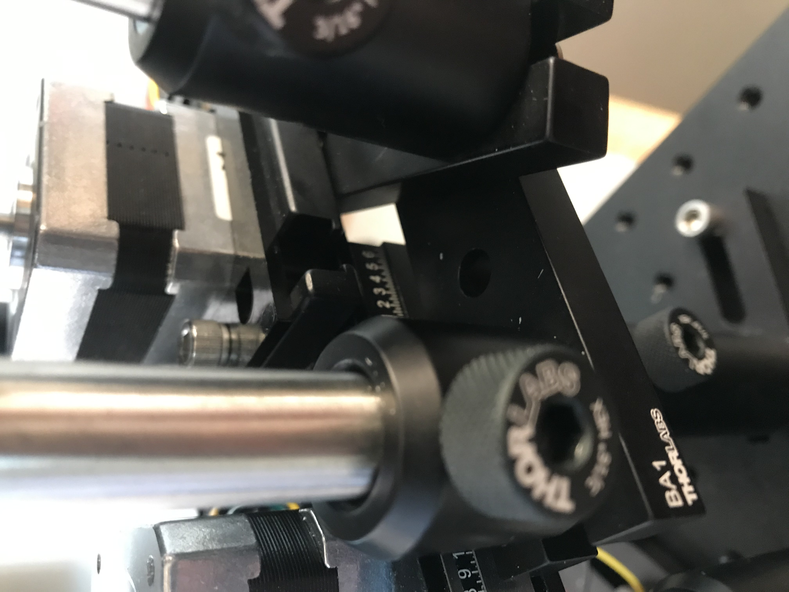
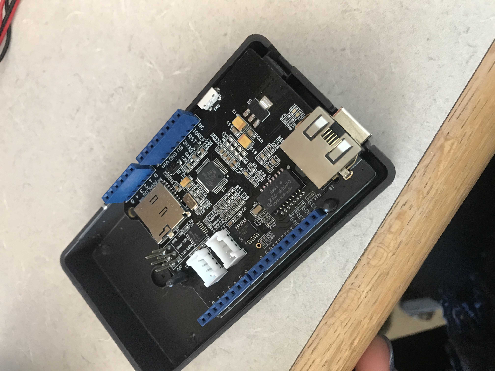
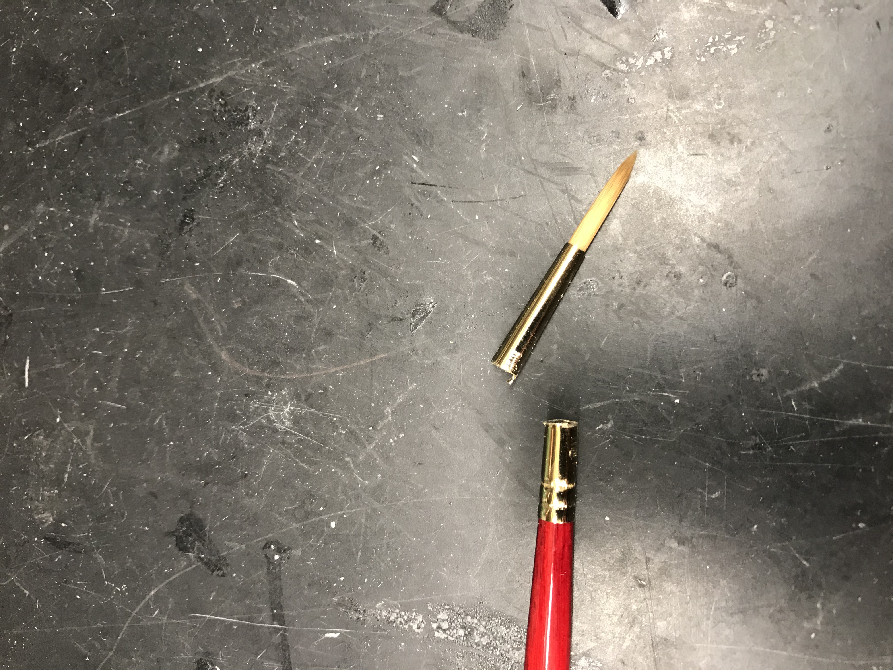

# Building Reaching Rig

1. Build frame (McMaster Aluminum T-Slotted Framing Extrusion, see Materials List for sizes). 
2. 3D print .stl files. I used Black V4 resin with a FormLabs 2 printer, but other printers and resins should work.
3. Laser cut .ai files. Note that the pellet presenter wheel has raster engraved sections (black fill). For all other lines (red), cut all the way through the acrylic sheet.
4. NOTE: Build the two halves of the behavior rig separately. We will then attach these two pieces to the box frame. Build: A. Pellet Disks Apparatus and B. Mouse House Apparatus on two separate breadboards. (This separation prevents transmission of the stepper motor vibrations to the mouse.) Optional: 3rd micrometer for up-down movement of mouse. Note that this rig could be built excluding all the micrometers (to save money), but I prefer to include at least 2 micrometers to increase positioning flexibility. 

[Two halves of rig from above](./photos/IMG_3734.JPG)

5. **BUILD PELLET DISKS APPARATUS**
6. Assemble raised micrometer platforms. Use appropriate Thorlabs posts and post holders to ensure that the height of Pellet Disks Apparatus matches the height of Mouse House Apparatus. 

[Raised micrometer](./photos/micrometer.jpeg)

7. Build mechanism to present food pellets. These plastic disks maneuver the food pellets. (Think: lazy susan.) There are 2 circular plastic disks. Each is secured to a stepper motor, which enables the disk to spin. The first (smaller) disk presents food pellets to the mouse. The second (larger) disk loads food pellets onto the first (smaller) disk. I call this first disk the “pellet presenter wheel”, and I call the second disk the “loader wheel”. Attach each circular disk to the top of a stepper motor shaft: Hold the plastic disk in place with quick-drying glue (e.g., Loctite/Zipkicker catalyst), then further secure this attachment for permanent hold using dental cement. There is a 3D-printed piece that  mates the “loader wheel” (plastic disk with 50 holes around the edge) to the stepper motor shaft. The “loader wheel” (plastic wheel) sits on the top of this 3D-printed piece. 

[Stepper motor, then 3D-printed piece, then loader wheel ](./photos/image(9).jpeg)

The “pellet presenter wheel” should sit directly on top of the motor shaft. Use a leveler to be sure that each wheel is mounted approximately flat with respect to the bottom of the stepper motor base. 

[Upright attachment method](./photos/wheel1.jpg)

[Level wheel](./photos/wheel2.jpg)

[Pellet loader wheel from above](./photos/Copyofimage(10).jpeg)

8. Use plastic “motor positioners” (plastic stencils) to correctly position the stepper motors on top of the micrometers. Place one motor positioner (black plastic cut-out) on top of the micrometer and screw down loosely. 

[“Motor positioner” on micrometer](./photos/image(5).jpeg)

The stepper motor attached to the pellet presenter wheel will sit in this front-most stencil. Attach a small, compatible Thorlabs plate (I used XT95P12, but you can use any compatible piece) to the back of the micrometer, and place the second motor positioner (plastic stencil) on this back plate.

[Plate and motor positioner for pellet loader](./photos/image(3).jpeg)

The stepper motor attached to the pellet loader sits in this back stencil. Loosely secure motor positioners to the micrometer platforms using screws. Place the stepper motors in the motor positioners.

[With motors](./photos/image(2).jpeg)

9. Gently move the “motor positioners” (plastic stencils) to move the stepper motors. Align the two wheels: a hole in the pellet loader wheel should be aligned directly above a hole in the pellet presenter wheel. 

[Aligned](./photos/image3.jpg)

Tighten screws. (We will need to adjust this again after plugging in the motors.) Be sure to use screw lengths that do not impede micrometer movements.
10. Build the pellet loader. 

   a. Stack these pieces inside of the large, 3D-printer pellet loader container, in this order: plastic ring with one hole 
   

   [here](./photos/image(7).jpeg),

   stepper motor with loader wheel 
   

   [here](./photos/image(6).jpeg),

   conical 3D-printed piece
   

   [here](./photos/imagejpeg.jpg).

   b. Put 6 mm rods through the holes in the two 3D-printed pieces to connect them. 
   c. Put the ends of the 6 mm rods into 2 CP02B pieces. 
   

   [Rods and one CP02B](./photos/image(8).jpeg)

   Attach the CP02B to Thorlabs posts. (I used a 1.5 inch post and a 2 inch post.) Set this assembly aside.
   d. Attach Thorlabs post holders to Thorlabs base BA1, and attach Thorlabs base BA1 to the back plate that supports the pellet loader wheel. Do this on both sides.
   

   [view 1](./photos/image.jpeg)

   

   [view 2](./photos/image(1).jpeg)

   e. Place the assembly from step 10c into the post holders. Note that these post holders now control the height of the pellet loader container.
   f. Adjust all pieces so that the stepper motor attached to the pellet loader wheel sits in the motor positioner/stencil. 
   

   [Pellet loader assembled](./photos/Copyofimage(4).jpeg)

11. Add the pellet chute/blocker. 

[Chute/blocker sitting on pellet presenter wheel](./photos/image(15).jpeg)

This is a 3D-printer piece with 2 components. The chute directs pellets out of the loader onto the pellet presenter wheel. 

[Chute sits in the hole in the bottom plastic piece of the pellet loader](./photos/image(13).jpeg)

The blocker knocks off pellets after several turns of the pellet presenter wheel. 

[Blocker](./photos/blocker.jpeg)

Set up a base (BA1), post holder and post to hold up the chute/blocker. 

[Post and post holder to position chute/blocker](./photos/image(16).jpeg)

[Attach BA1](./photos/image(12).jpeg)

Angle this base toward the front-side of the pellet presenter wheel, near the mouse. Insert a screw through the slot in the chute/blocker to loosely hold the chute/blocker in place. This post now controls the height of the chute/blocker. 

[Post holder](./photos/image(14).jpeg)

12. Add a mechanism for securing the other side of the chute/blocker. The chute/blocker needs to be very secure in order to properly knock off pellets sitting in the recessed holes of the pellet presenter wheel. Attach BA1S to the micrometer

[here](./photos/image(17).jpeg),

then attach a post holder and post with another BA1S or other base at the top (later, I switch to BA1 for the top piece, but various pieces will work). (I used a 2 inch post.) This base piece sits on top of the chute/blocker

[here](./photos/image(19).jpeg).

We will glue the base piece to the chute/blocker, once all positioning is finalized. This prevents the blocker from moving as pellets repeatedly hit the side of the blocker.

[Another image from above](./photos/image(18).jpeg)

13. Stack Arduino shields.

[Stack 1](./photos/image(25).jpeg)

[Stack 2](./photos/image(24).jpeg)

[Stack 3](./photos/image(23).jpeg)

[Stack 4](./photos/image(26).jpeg)

(In my code, the pellet presenter wheel goes to M3 / M4 of Arduino V2 motor shield, and the pellet loader wheel goes to M1 / M2 of Arduino V2 motor shield.)
14. Adjust positions of all components. Critical step! Position pellet loader wheel, pellet presenter wheel, and the chute/blocker, all with respect to each other. Note that correct positioning of these components is vital to proper rig function.

   a. First, notice that the stepper motors have preferred step positions (i.e., angles). (To see this, wire up auxiliary power to Arduino motor shield, plug a motor into the Arduino motor shield, and make the motor step forward. Motor will only step to certain angles.) Be sure that you are positioning the pellet loader wheel and the pellet presenter wheel with the stepper motors at positions that are allowed when the motors are plugged in.
   b. My design assumes that both stepper motors turn clockwise.
   c. Let me explain how pellet loading works. 1) Pellets in the fifty holes of the pellet loader wheel are moved toward the lip of the 3D-printed conical piece
   

   [here](./photos/image(13).jpeg).

   Only one pellet can fit below the lip of this 3D-printed piece, which prevents more than one pellet from loading at a time. 2) The pellet that fits below this lip falls through the chute onto a recessed hole of the pellet presenter wheel.
   

   [Chute situated in the hole of the bottom plastic piece in pellet loader](./photos/chute_in_hole.jpeg)

   3) The pellet presenter wheel turns, moving the pellet away from the loading position. A new recessed hole of the pellet presenter wheel now sits below the chute. 4) The pellet loader wheel turns again, loading a pellet through the chute. 5) If pellets are not grabbed by the mouse, after 5 to 6 turns of the pellet presenter wheel, the pellets will be knocked off by the blocker. Accomplishing this without errors requires that all rig components be properly positioned. Be patient. Getting everything right takes a little time.
   d. The next adjustments should be made after the motors are plugged into the Arduino motor shield, so that we can see how the motors turn and move pellets through the apparatus.
   e. First, align pellet presenter wheel with the pellet loader wheel. Get the two holes and the chute lined up. Be sure that these holes are beneath the lip of the 3D-printed piece. At the same time, be sure that the blocker is secured in a position where a turn of the wheel will cause the pellets to hit the curve of the blocker on a trajectory approximately tangent to the blocker
   [for example](./photos/Smooth.MOV).
   Secure all relevant components.
   
   f. Second, set the height of the chute/blocker. Use the two posts on either side to control the height of the chute/blocker. We want the bottom of the chute/blocker to just be touching the top of the pellet presenter wheel.
   

   [Height of chute/blocker](./photos/height.jpeg)

   g. Third, set the height of the pellet loader container with respect to the pellet loader wheel. Place some pellets into the loader wheel. 
   

   [Here](./photos/image(22).jpeg)

   The height of the pellet loader container can be adjusted using the side posts. The bottom plastic piece with one hole should be at a height where pellets just sit in the holes, and the top of each pellet is flush with the top of the plastic pellet loader wheel. Rotate the wheel containing pellets to be sure that the height is correct at all angles.
   

   [Pellets rotated](./photos/image(21).jpeg)

   We don’t want the pellets to slip between the two plastic pieces. Be sure that the pellets slide just under the lip of the 3D-printed conical piece. Once the heights are correct, secure the bottom plastic piece (with one hole) to the large, 3D-printed pellet loader container using Loctite and Zipkicker (I prefer to use this glue, because it can be easily chipped away using needle-nose pliers if a mistake is made).
   

   [Glue tacks plastic piece to loader container](./photos/IMG_7702.jpg)

   h. Use clay to secure the position of the conical, 3D-printed piece along the rails. I like to use clay, because the piece can be moved in case of a jammed pellet.
   

   [Clay to hold conical 3D-printed piece](./photos/IMG_7713.jpg)

   There is not much force in this direction along the rails, so clay is sufficient to hold the 3D-printed conical piece in place.
   i. Plug in the motors and have the pellet presenter wheel turn many times. Be sure that each hole is beneath the chute. Once you are happy with the position of the pellet presenter wheel’s stepper motor, use Kwik-Cast between the stepper motor and the motor positioner to prevent the motor from rotating side-to-side. 
   

   [Kwik-Cast is the green stuff](./photos/IMG_7714.jpg)

   Also, use zip ties to hold down the motor. Be sure that the position of the zip ties does not get in the way of a reasonable range of micrometer movements.
   

   [Note zip ties](./photos/height.jpeg)

   j. Zip tie the pellet loader wheel to the back plate. After this, you may need to readjust the height of the pellet loader container.
   k. A couple things to check at this point: Remove power to the stepper motors, and turn the wheels manually. Check that the pellet loader wheel moves smoothly through all angles. If not, you may need to slightly readjust the position of the outer 3D-printer pellet loader container. Check that the pellet presenter wheel moves smoothly through all angles. If not, you may need to readjust the height of the chute/blocker. 
   

   [Smooth movement of wheel through all angles](./photos/IMG_7716.mov)

   l. Now, let’s turn on the motors and load pellets. Here we are checking that pellets are loaded properly from the loader onto the pellet presenter wheel, and also we are checking that the blocker knocks off pellets.
   m. Adjust the position and height of the chute/blocker, so that pellets are smoothly knocked off the wheel by the blocker. Remove power to the stepper motors, so that you can turn the wheels manually and find an optimal position for the blocker.
   [Example of bad height/pellets jamming](./photos/Jamming.MOV)
   [Example of good position and height/pellets removed smoothly](./photos/Smooth.MOV)
   n. Now we will add the final component to ensure smooth removal of the pellets from the pellet loader wheel. I use a paintbrush.
   

   [Cut off the end of the paintbrush](./photos/IMG_7729.jpg)

   Correct positioning of this paintbrush is necessary for proper operation. Play with different positions of the paintbrush while the motors load and present pellets. Note that some positions of the paintbrush work well to brush off the pellets before they hit the blocker; other positions of the paintbrush are ineffective. I find that the optimal position is: paintbrush pointing straight down, tip of paintbrush just sits in the hole on the pellet presenter wheel, paintbrush glued at the tip of the blocker. As you can see in this video, the paintbrush should roll the pellets out of the holes before they hit the blocker.
   [Video](./photos/IMG_7738.MOV)
   With all components properly positioned, this approach is very effective. I run the rig for 5 hours each day without jams. Once you are satisfied with the positioning of the paintbrush, glue it to the blocker using Loctite and Zipkicker (you don’t need much glue, and you can break off the paintbrush and re-glue it later, if necessary).
   o. Some final videos demonstrating pellet loading and presentation 
   [Pellets loading](./photos/IMG_7739.MOV)
   [Pellets presented](./photos/IMG_7740.MOV)
   
15. **BUILD MOUSE HOUSE** 

[Mouse enclosure with distractor LED](./photos/IMG_3743.JPG)

16. Build the structure of the mouse house apparatus using ThorLabs parts.

[Something like this](./photos/IMG_7669.jpg)

Be sure that the height of the mouse house apparatus matches the height of the pellet loading apparatus.
17. Glue mouse house sides to the mouse house bottom, and tape the mouse enclosure to the base plate (BA2) at the back of the mouse house apparatus. 

[Here](./photos/IMG_7671.jpg)

18. Set up perch for mouse paws. Cut pieces of the perch to size. Attach the 3D-printed perch to 2 Thorlabs posts. Push perch to the correct height with respect to the pellet presenter wheel.

[Perch](./photos/IMG_3743.JPG)

19. Set height of mouse house. Adjust post beneath the mouse enclosure to the correct height, so that the perch and mouse enclosure bottom are at the same level. We want the mouse’s paws, which sit on the perch, to be level with the bottom of the mouse’s body, which sits within the mouse enclosure.

[Perch positioning](./photos/IMG_3743.JPG)

20. Position two halves of behavior rig. Position the mouse house apparatus and the pellet wheels apparatus with respect to each other by maneuvering breadboards. Secure the pellet wheels apparatus to the front of the McMaster behavior box frame, and secure the mouse house apparatus to the back of the behavior box frame.

[Rig from above. Note two separate breadboards for two halves of rig](./photos/IMG_3734.JPG)

21. Place Arduino and Arduino shields in protective box. Cut bottom half of the gray Arduino project box to size, so that it fits inside the black laser-cut Arduino enclosure. Place Arduino with shields onto the gray Arduino project box, trimming the posts in this box, if necessary, to accommodate the Arduino shields. Place gray project box with Arduino and shields into the laser-cut Arduino enclosure.

[See box enclosing Arduino in bottom of photo](./photos/IMG_3734.JPG)

22. **ALL THE REST OF THESE STEPS ARE OPTIONAL, DEPENDING ON YOUR EXPERIMENTAL GOALS. THESE NEXT STEPS ARE SPECIFIC TO MY EXPERIMENTS.**
I have the mice perform the reaching behavior in the dark. For my experiments, it is important that the mice cannot see, smell or whisk the food pellets, and it is important that the mice cannot hear the pellet presenter stepper motor.
23. Add infra-red filter and lens to TTL camera.
A. Add infra-red filter. The infra-red LEDs in the camera also emit in the red spectrum. To prevent leakage of this red light into the behavior box space, put an infra-red (IR) filter into the behavior camera. (We don’t want visible light to illuminate the inside of the behavior box.) Open TTL camera. Get IR filter. Cut the IR filter into a circular shape, so that the cut filter fits in the camera housing just behind the front plastic window. The filter should be big enough to fully cover the outer ring of IR LEDs. Cut a small hole at the center of the circular IR filter, matching the size of the camera lens. Place the IR filter behind the camera’s front window. and add a second lens in front of the camera’s lens. (Choose a lens that places the animal’s paws in focus, e.g., 50 mm focal length.) Close the TTL camera, screwing the front window back on. The goal of this IR filter is to be sure that red light from the infra-red (IR) LEDs does not illuminate the behavior box, because the IR LEDs in this camera have some emission in red, as well as infra-red. 
B. Add lens to TTL camera.

[Camera](./photos/IMG_3742.JPG)

24. Position camera. Attach the camera to a Thorlabs post, and position the post-holder and post on the base breadboard near the pellet wheels apparatus. Point the camera at the mouse house.

[Camera pointed at mouse house](./photos/IMG_3742.JPG)

25. Make behavior box front door. Cut holes in the front door for attachment of two hinges on the left and one metallic piece (component of the McMaster magnetic latch) on the right. Attach the door to the frame. 

[Door with hinges](./photos/IMG_3746.JPG)

[Other half of door magnetic latch on McMaster behavior box frame](./photos/IMG_3747.JPG)

26. Add the sides, bottom, back and top of the behavior box.
27. Attach the McMaster magnetic latch to hold the door shut. Attach one half of the magnetic latch to the door, and attach the other half to the behavior box frame. Door should be held shut by the magnet but easily opened by hand. Change strength of this force by adjusting overlap of 2 magnet latch pieces. 

[Half of magnetic latch on McMaster behavior box frame](./photos/IMG_3747.JPG)

[Magnetic latch on behavior box frame, with interlock wires threaded through](./photos/IMG_3752.JPG)

28. (Optional) Set up a mechanism for detecting door opening. Set up the interlock (one piece on the door, with the other piece on the behavior box frame), and thread interlock wires through the behavior box frame to the Arduino.

[Interlock (half on door, half on McMaster behavior box frame, wires threaded through frame into behavior box)](./photos/IMG_3747.JPG)

[Interlock wires entering Arduino box](./photos/IMG_3745.JPG)

29. Mask sounds: Set up speakers for noise to mask the sound of the stepper motors. Record the sound of the pellet presenter wheel. Use audio software (e.g., Audacity) to create an hour-long repetition of this noise. Save to a computer or iPad. Attach and plug in this device to speakers.

[See orange speaker beneath camera, next to stepper motor and pointed at mouse house](./photos/IMG_3742.JPG)

30. Position the small speakers as close to the pellet presenter stepper motor as possible, on either side of the mouse. These speakers will play the sound of the stepper motor continuously, thus masking the noise from the stepper motor turning.

[See orange speakers on either side of stepper motor](./photos/IMG_3734.JPG)

Record the sound of the stepper motor, and play this sound back through the speakers. Check the volume. These speakers can be quite loud without disrupting behavior. I play the masking noise at approx. 90 dB. With good sound-proofing, this is attenuated to between 60 and 70 dB just outside of the closed box. Yes, mice hear ultrasonic sounds. Empirically, it seems that the mice cannot hear or do not attend to the stepper motor noise when I play the masking sound loudly. Note that different stepper motors or configurations of the behavior box might produce ultrasonic sounds that cannot be masked by these little speakers.
Additionally, I only load pellets in a fraction of the holes on the pellet presenter wheel, so that the sound of the moving stepper motor is not perfectly correlated with pellet presentation. 
31. Add high-speed cameras and mirrors.
32. Ensure that behavior box is light-tight.
33. Make behavior box chamber anechoic. Use sound-insulating foam inside the box.
34. Make behavior box top secure but removable.
35. Power the electronic components. Solder DC barrel jacks to the powered components. Label power supplies and plug into barrel jacks. (Check that each electronic component is getting the correct power supply, e.g., 5 V or 12 V. Note that camera takes 5 V, and Arduino takes 12 V.) String power cables through the top side of the behavior box frame and into the box.

[Power cables entering through back top of box](./photos/IMG_3734.JPG)

36. Set up camera output. Solder an analog video output connector to the TTL camera output. This connector will mate with the DVR cables. 
37. Add DVR. Attach DVR to the McMaster frame.

[DVR attached to McMaster box frame](./photos/IMG_3754.JPG)

38. Hook up DVR. Hook up the camera output to the DVR input, and hook up the DVR output to the small video monitor. 
39. Configure DVR settings. 

   a. Load onto an SD card a file called “system.txt” that has one line in it reading: “F30V1S9”.
   b. Put this SD card into the DVR, and wait for the DVR to start up.
   c. Use remote control to set DVR settings to “English”, “VGA”, “Continuous” and “NTSC” (output of TTL camera is in NTSC format).
   d. Wait for DVR to record a short video file.
   e. Check video file on computer.
   f. DVR will now write a new movie file each time the SD card is inserted.
   g. Note that unplugging the DVR may cause the recording configuration to reset. (I keep the DVR plugged-in and on all the time.)

40. Load code onto Arduino. Put a micro-SD card into the Ethernet shield of the Arduino, load code onto the Arduino, and test Arduino. May need to change “chip select” pin for writing to micro-SD card. For example, Arduino Ethernet shield with W5500 chip set will use “chip select” pin 2, whereas Arduino Ethernet shield 2 will use “chip select” pin 4.
41. Wire up a distractor LED. Hook up the Arduino digital output to the LED positive lead. Hook up a resistor to the LED negative lead, then hook up the other end of the resistor to Arduino ground.

[Distractor LED on top of mouse enclosure](./photos/IMG_3743.JPG)

42. Cover LEDs on small speakers to prevent illumination of inside of behavior box.
43. Trim whiskers.
44. Mask smell. The mice can smell the pellets approaching. There are 2 options here. Option 1. Insert a small tray beneath the mouse. Fill this tray with fresh pellets. Change these pellets frequently. These pellets mask the smell of pellets on the pellet presenter wheel. Option 2. Use a small CPU fan pointed at the mouse’s face to move air around within the behavior box. This will prevent the animals from localizing the approaching pellet based on smell. I now use Option 2 exclusively.
45. If doing optogenetic stimulation, use a mating sleeve covered in black tape and clay to fully block the exit of optogenetic light from the fiber and mating sleeve into the behavior box space.
46. (Optional) Raise the behavior rig for easier cleaning. I raised all components and inserted removable drawers at the bottom of the rig, so that dropped pellets could be collected in the drawers and easily thrown away.
